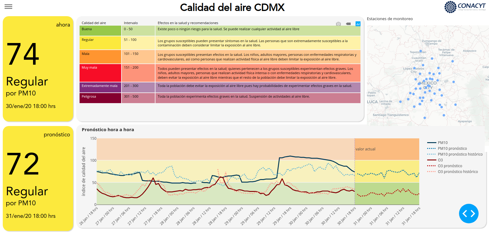

[](https://travis-ci.com/DanielBustillos/Pronostico-contaminacion-CDMX)
[](https://github.com/pandas-dev/pandas/blob/master/LICENSE)
# Air Quality Forecast in the Metropolitan Area of   Mexico City

This repository contains a set of machine learning models to forecast the pollutants in in the Metropolitan Area of   Mexico City. The models are optimized to obtain a low false positive rate according to the levels of the [environmental contingency program](http://www.aire.cdmx.gob.mx/default.php).


Models were developed to forecast pollution levels in Mexico City, the pollutants predicted are the following:

<<<<<<< HEAD
Para cada contaminante se desarrollaron modelos para pronosticar sus niveles con hasta 24 horas de antelación, se obtuvo un error comparable a la bibliografía.
=======
  - PM10
  - PM2.5 (in development)
  - Ozone
>>>>>>> e0a87a6d4829dc74e5e286e47c4faee3538e762a

  There is a [dashboard of the project](https://github.com/paupradel/calidad_aire_cdmx), developed in the Repositories, Research and Prospective Coordination (CRIP) of the National Council of Science and Technology (CONACyT).

  The aim of the dashboard is to inform the population of the Valley of Mexico in a friendly and direct way about the state of air quality in it. It consists of a dashboard that shows the current status of the air quality index, and is updated hourly. The index is obtained from the data shared by the Ministry of Environment (SEDEMA) of the Government of Mexico City and can be found here. Also using machine learning algorithms, a model that estimates the air quality index 24 hours ahead was built. The table shows this estimate as well as a line graph of the hour-to-hour estimate of the index of suspended particles less than 10 micrometers (PM10) and ozone (O3).


Pollution and meteorological data are obtained from the [CDMX air quality portal.](http://www.aire.cdmx.gob.mx/default.php)

<<<<<<< HEAD
### Ruta Crítica
=======
>>>>>>> e0a87a6d4829dc74e5e286e47c4faee3538e762a

#### -- Project Status: [On-Hold]

## Summary

For each pollutant models were developed to forecast their levels up to 24 hours in advance, an error comparable to the literature was obtained.

<<<<<<< HEAD
 - Mejorar el modelo usando otras variables no consideradas, por ejemplo, los incendios forestales o la emisión de ceniza volcánica.


# Air Quality Forecast in the Metropolitan Area of ​​Mexico City

This repository contains a set of machine learning models to forecast the pollutants in in the Metropolitan Area of ​​Mexico City. The models are optimized to obtain a low false positive rate according to the levels of the [environmental contingency program](http://www.aire.cdmx.gob.mx/default.php).


Models were developed to forecast pollution levels in Mexico City, the pollutants predicted are the following:

  - PM10
  - PM2.5 (in development)
  - Ozone


Pollution and meteorological data are obtained from the [CDMX air quality portal.](http://www.aire.cdmx.gob.mx/default.php)


#### -- Project Status: [On-Hold]

## Project Intro/Objective
For each pollutant models were developed to forecast their levels up to 24 hours in advance, an error comparable to the literature was obtained.

The following graph shows the actual and predicted values 12 hours in advance for PM10:


### Contribuitors

* [Paulina Pradel](https://github.com/paupradel) in the visualization and web dashboard section.
=======
The following graph shows the actual and predicted values ​​12 hours in advance for the Ozone:


- PM10 (24 hours Moving average):


The mean RMSE is about 11.59%, the next graph shows the RSME by hour:


 For more info about the performance of the models, don't hesitate to contact me.


### Contributors

* [Paulina Pradel](https://github.com/paupradel) visualization and web dashboard.
* [Daniel Bustillos](https://github.com/DanielBustillos) data analysis and modelling.
>>>>>>> e0a87a6d4829dc74e5e286e47c4faee3538e762a


### Methods Used
* Inferential Statistics
* Machine Learning
* Data Visualization
* Predictive Modeling
<<<<<<< HEAD
* etc.

### Technologies
* Python
* Plotly
* PostGres
* Pandas, jupyter
* HTML


## Project Description
(Provide more detailed overview of the project.  Talk a bit about your data sources and what questions and hypothesis you are exploring. What specific data analysis/visualization and modelling work are you using to solve the problem? What blockers and challenges are you facing?  Feel free to number or bullet point things here)

## Getting Started

1. Clone this repo (for help see this [tutorial](https://help.github.com/articles/cloning-a-repository/)).
2. Raw Data is being kept [here](Repo folder containing raw data) within this repo.

    *If using offline data mention that and how they may obtain the data from the froup)*

3. Data processing/transformation scripts are being kept [here](Repo folder containing data processing scripts/notebooks)
4. etc...

*If your project is well underway and setup is fairly complicated (ie. requires installation of many packages) create another "setup.md" file and link to it here*  

5. Follow setup [instructions](Link to file)

## Featured Notebooks/Analysis/Deliverables
* [Notebook/Markdown/Slide Deck Title](link)
* [Notebook/Markdown/Slide DeckTitle](link)
* [Blog Post](link)
=======

### Technologies
* Python
* Scikit
* Plotly
* PostGres
* Jupyter
* HTML

## Getting Started

If you want to access the forecast it is suggested to visit the dashboard directly (soon). If you need to compute the forecast, it is enough to follow the following steps:

1. Clone this repo (for help see this [tutorial](https://help.github.com/articles/cloning-a-repository/)).
2. Raw Data is being kept [here](https://github.com/DanielBustillos/Pronostico-contaminacion-CDMX/tree/master/datasets/por_hora) within this repo.


3. The forecast and data processing/transformation scripts are implemented in a data pipeline, to run it, simply run in a terminal:
  ```
  python pipeline_general/pipeline/4_predicción.ipynb
  ```

## Featured Notebooks/Analysis/Deliverables
* [Narrativa de Calidad de Aire](https://github.com/paupradel/airecdmx_narrativa)
* [DashBoard de Calidad de Aire](https://github.com/paupradel/calidad_aire_cdmx)


>>>>>>> e0a87a6d4829dc74e5e286e47c4faee3538e762a


## Contributing DSWG Members

<<<<<<< HEAD
**Team Leads (Contacts) : [Full Name](https://github.com/[github handle])(@slackHandle)**

#### Other Members:

|Name     |  Slack Handle   |
|---------|-----------------|
|[Full Name](https://github.com/[github handle])| @johnDoe        |
|[Full Name](https://github.com/[github handle]) |     @janeDoe    |

## Contact
* If you haven't joined the SF Brigade Slack, [you can do that here](http://c4sf.me/slack).  
* Our slack channel is `#datasci-projectname`
=======
Team Leads (Contacts) : [Juan Daniel Bustillos Camargo](https://github.com/DanielBustillos)(juandaniel.bucam@gmail.com)

#### Other Members:


|Name     |  Role   |
|---------|-----------------|
|Norberto Morales| Data Engineer |

## Contact
* If you haven't joined the SF Brigade Slack, [you can do that here](http://c4sf.me/slack).  
>>>>>>> e0a87a6d4829dc74e5e286e47c4faee3538e762a
* Feel free to contact team leads with any questions or if you are interested in contributing!
